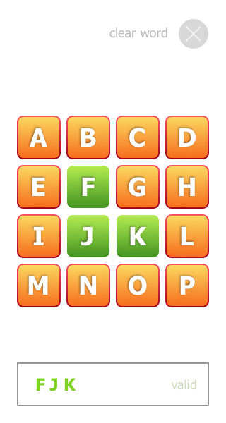
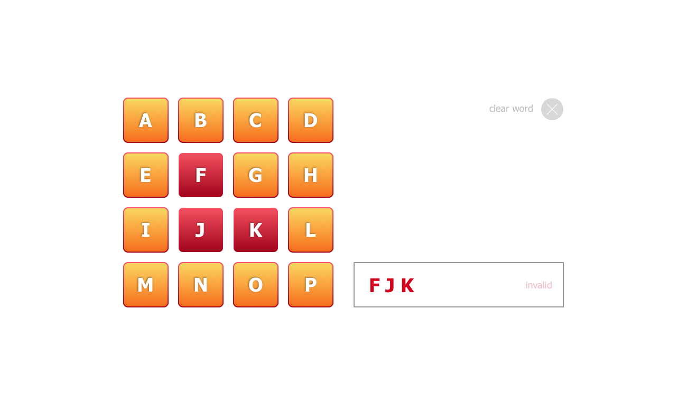

# Enara Health • Fullstack Interview • Letters game!

*Version 1.4*

## This is a coding challenge for applicants interested in joining Enara Health.

We ask you to *read this file completetly* **before** you begin working on your solution. 
After reading all the instructions, please **estimate** when you expect to complete and deliver your solution and **send us a brief note**.
You should only work on your solution **after you've read this file completely and you've send us your estimation!**

There is a Q&A and an example section at the end of the file, which may help you to complete this challenge faster.

We sincerely thank you for your interest and your time.

Good luck! 

The Enara Health team!

## Create a React JS or React Native app

- You can use any boilerplate or start project. If you need help with this, let us know and we will share a quick-starter project promptly.
- Keep your code separated from the boilerplate, so it's easier to evaluate your work.
- We strongly prefer TypeScript or typed JavaScript.

### The app

- Our game will present a board with 16 tiles (4x4) in the center of the screen.
- Upon load, each tile should be randomly assigned letter (or letters should be read on load from a given json file: see [`test-board-1.json`](files/test-board-1.json) and [`test-board-2.json`](files/test-board-2.json)).
- The user can select tile by clicking/tapping them. 
	- Each tile can be selected once: The user cannot select the same tile twice.
	- **Extra points**: After the first letter, the user can only select neighbor tiles to the last tile selected.
- At the bottom of the board, display the word formed by the selected tiles.
	- **Extra points**: Validate if the word is contained in a [`dictionary.json`](files/dictionary.json) file. You can set up your board using the letters from our [secondary board file](files/test-board-2.json), which contains many words from the dictionary!
- Add a button `(x)` to reset the board, deselecting all tiles and clearing the word.

#### Example

In the following example, the initial board presents the content of the [test json file 1](files/test-board-1.json), and has no tile selected. There's no formed word either. The reset button is disabled.

Then, the user clicks the F tile, which gets selected. The formed word is now `F`. The reset button is now enabled.

The user selects the A tile by clicking it. The formed word is now `FA`. Finally, the user selects the B tile. The formed word is now `FAB`.

If the user clicks the reset button, the board is reset.

```
              ( )                 (x)                 (x)                 (x)
    A  B  C  D          A  B  C  D         [A] B  C  D         [A][B] C  D
    E  F  G  H          E [F] G  H          E [F] G  H          E [F] G  H
    I  J  K  L          I  J  K  L          I  J  K  L          I  J  K  L
    M  N  O  P          M  N  O  P          M  N  O  P          M  N  O  P
            
   [          ]        [ F        ]        [ FA       ]        [ FAB      ]
```

### Requirements

- Choose whatever would be easier/faster for you – React JS or React-Native (unless you are applying for a specialized position).
- **Extra points**: Make sure you only let the user select neighbor tiles!
- Make it look exactly like the following designs:
	- ReactJS only: Use *responsive* display for mobile and desktop.
	
	- Match the exact pixel size and color of our designs using exclusively CSS (not background images).

        - Ignore "Valid" or "Invalid" part of the designs unless you go for the **extra points**!

	- Layour for mobile media:

		

	- Layout for desktop media (ReactJS only):

		
		
---

## Submitting your work 

Your deliverable should satisfy all these requirements:

- It should include *instructions on how to run* (installing dependencies, starting it, etc) – Avoid weird environment requirements.

- It should be published using one of the following alternatives:
    1. bitbucket.org or github.com repo.
    1. Upload a compressed file somewhere and send us the URL.
    - *Note: Do NOT include `node_modules` or any other files that will be auto-generated*.

- **Extra points**: Deploy your solution using a free hosting service and send us the URL.

Once you've published your solution, send us a note with the links via **the same hiring platform** you applied (GetOnBoard, LinkedIn, Angel.co), so our team can take a look. 

---

## Evaluation criteria

We will evaluate the following aspects of your deliverable:

- **Requirements**: This includes "Does it look exactly like our designs", "Does it implement all rules of the game" and "Do you follow the delivery instructions".
- **Code quality**: This includes following coding standards, formatting and other quality aspects.
- **Code design**: This includes design patterns and architecture, modularity, maintanability, readability, and other code design aspects.  

---

## Frequently asked question

- Q: How long do I have to complete and deliver my challenge?
    - You should take the time you need to create this: Most likely, you are currently working so you have little free time, so we understand this won't be immediate.
    - However, as soon as posible, __send us a note__ describing your estimation and letting us know __when__ do you expect to submit your work.
    - If this time is not compatible with the process timing, we will let you know and we can agree in a time that works for both of us. Most likely, your initial estimation will be within our process timing.
- Q: Can I use external libraries (npm)?
    - Of course you can!
    - However, if some functionality is very easy to implement, try to implement it yourself (i.e. Don't install a library to figure out if a number is odd/even).
    - Choosing when and what libraries will speak about your judgement.
- Q: This coding challenge is too long. Is it OK if I implement it partially?
    - Although we recognize this exercise may take some time, it does measure if you have the skills we need to work at Enara Health.
    - Submitting an incomplete solution is acceptable, specially if you explain the reasons. 
    - However, a complete solution will increase the likelihood of being selected, and it will save time during our in-person interview. 


## Thanks for your time!
The Enara Health team!

## Instructions

 - Clone the project
 - Use command `npm install` to install dependencies (use node version higher than v16)
 - use command `npm start`

